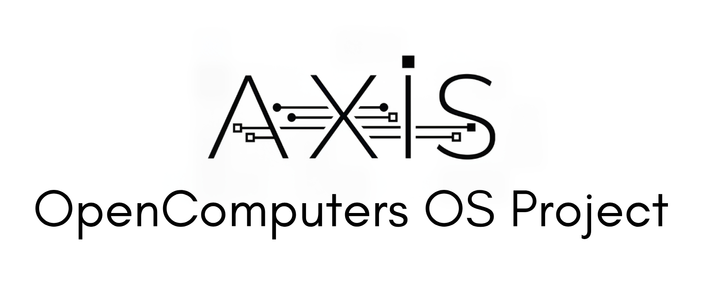

<p align="center">
  
</p>

# Axis OS

  

| Feature | Specification |
| :--- | :--- |
| **Kernel** | **Xen XKA** (eXtensible Kernel Architecture) |
| **Driver Model** | **AXON** (Abstract Xen Object Network) |
| **IPC** | **Synapse** Protocol |
| **Security** | **RKA** (Ringed Kernel Authority) |

**Axis OS** is a multitasking, microkernel-like operating system designed for the OpenComputers mod. Unlike standard OpenOS, which provides a thin wrapper around Lua libraries, Axis OS implements a strict separation of concerns, simulating an enterprise-grade architecture with privilege rings, an I/O request packet (IRP) driver model, and Access Control Lists (ACLs).

> **Warning:** This OS is highly experimental. It fundamentally changes how software interacts with OC components. Standard OpenOS programs will likely require porting to work within the Axis sandbox.

---

## 🏗 System Architecture

Axis OS is built on four core pillars:

### 1. Xen XKA (Kernel)
The kernel (Ring 0) is minimal by design. It handles:
*   **Process Scheduling:** Cooperative multitasking with priority queues.
*   **Memory Sandboxing:** Strict environment isolation. User processes have no access to the global `_G`.
*   **Privilege Rings:**
    *   **Ring 0:** Kernel / Hardware abstraction.
    *   **Ring 1:** System Services (Pipeline Manager, DKMS).
    *   **Ring 2:** Drivers.
    *   **Ring 3:** User-space applications.

### 2. AXON (Driver Model)
The **Abstract Xen Object Network** replaces direct component access.
*   **Virtual Devices:** User programs write to virtual nodes (e.g., `/dev/tty`, `/dev/gpu0`) instead of calling `component.invoke`.
*   **DKMS Supervisor:** The Dynamic Kernel Module System manages driver lifecycles and provides a Watchdog service to restart crashed drivers without a kernel panic.
*   **IRP Flow:** All I/O is handled via **I/O Request Packets**. A `write()` call generates an IRP, which passes through the Pipeline Manager to the specific driver.

### 3. Synapse IPC
Inter-Process Communication protocol. Since processes are fully isolated, they communicate via signals. The kernel acts as the message bus, routing signals between User Space, the Virtual File System (VFS), and Drivers.

### 4. RKA (Security)
The **Ringed Kernel Authority** replaces standard permission checks.
*   **Handles vs. FDs:** File Descriptors are process-local. A process cannot guess or access another process's open files.
*   **ACLs:** Granular file permissions beyond standard UNIX bits (defined in `/etc/perms.lua`).
*   **RPL Checks:** *Requested Privilege Level* checks prevent "Confused Deputy" attacks, ensuring drivers do not perform privileged actions on behalf of unprivileged users.

---

## ⚡ Installation

**Requirements:**
*   Tier 3 CPU (APU recommended).
*   Tier 3 RAM (minimum 2 sticks).
*   Tier 3 HDD or RAID.

**Installation:**
no current installer

**Post-Install:**
Upon first boot, the **Axis Setup Utility** (BIOS) will run. You can configure boot timeout, log levels, and memory testing behavior here.

---

## 🖥 User Guide

### The Shell
The default shell (`/bin/sh.lua`) supports standard UNIX-like syntax:
*   **Pipes:** `cat /dev/ringlog | grep error`
*   **Redirection:** `echo "config=true" > /etc/app.cfg`

### Package Management
Axis uses `pkgman` for software management.
```bash
pkgman -S net-tools    # Install package
pkgman -S gpu-driver driver  # Install a driver module
```

### The `/dev` Filesystem
Hardware interaction happens via the VFS:
*   `/dev/tty`: Current terminal output.
*   `/dev/ringlog`: Kernel log circular buffer.
*   `/dev/gpu0`: Primary graphics adapter.
*   `/dev/net`: Network card interface.

---

## 🛠 Developer Documentation

### System Calls
Direct hardware access is blocked. Use the `syscall` library.

```lua
local sys = require("syscall")

-- Spawning a process
local pid = sys.spawn("/bin/my_app.lua")

-- Low-level I/O (usually handled by io/fs libs)
sys.syscall("vfs_write", handle, "data")
```

### Writing Drivers (AXON)
Drivers run in Ring 2 and must return a table containing `DriverEntry`.

**Example Minimal Driver:**
```lua
local tStatus = require("errcheck")
local oDK = require("dkms_api")

g_tDriverInfo = {
  sDriverName = "SampleDriver",
  sDriverType = "KernelModeDriver", 
  nLoadPriority = 100
}

function DriverEntry(pDriverObject)
  oDK.DkPrint("Driver Loaded")
  
  -- Register IRP Handler
  pDriverObject.tDispatch[0x03] = function(dev, irp) -- IRP_MJ_READ
      oDK.DkCompleteRequest(irp, tStatus.STATUS_SUCCESS, "Read Data")
  end
  
  -- Create Device
  oDK.DkCreateDevice(pDriverObject, "\\Device\\Sample")
  oDK.DkCreateSymbolicLink("/dev/sample", "\\Device\\Sample")
  
  return tStatus.STATUS_SUCCESS
end
```

---

## ⚠️ Troubleshooting

**Q: The system is slow/laggy.**
A: Axis OS creates overhead due to the IRP chain and Lua context switching. Ensure you are using Tier 3 hardware. Reduce the logging level in BIOS to `Error` to save GPU cycles.

**Q: "Access Denied" when reading a file.**
A: Check `/etc/perms.lua`. Axis enforces strict UID checks. If running as `guest` (UID 1000), you cannot touch system files. Use `su` to elevate.

**Q: Kernel Panic: "Watchdog Timeout"**
A: A driver or process hung without yielding. Check `/dev/ringlog` for the stack trace.

---

# Technical Documentation

### Part I: Core Concepts
*   **[1. Introduction](./doc/01_Introduction/01_Architectural_Overview.md)**
    *   [1.1. Architectural Overview](./doc/01_Introduction/01_Architectural_Overview.md)
    *   [1.2. Core Design Philosophies](./doc/01_Introduction/02_Core_Philosophies.md)

### Part II: The Kernel
*   **[2. The Xen EXtensible Kernel Architecture (XKA) ](./doc/02_Kernel/01_Kernel_Architecture.md)**
    *   [2.1. Kernel Architecture](./doc/02_Kernel/01_Kernel_Architecture.md)
    *   [2.2. The Boot Sequence](./doc/02_Kernel/02_Boot_Sequence.md)
    *   [2.3. The Process Model and Lifecycle](./doc/02_Kernel/03_Process_Model.md)

### Part III: System Programming Interfaces
*   **[3. The System Call Interface](./doc/03_System_Calls/README.md)**
*   **[4. The AXON Driver Model](./doc/04_Driver_Model/README.md)**
    *   [4.1. Kernel-Mode Driver Framework (KMDF)](./doc/04_Driver_Model/01_KMDF_Reference.md)
    *   [4.2. User-Mode Driver Framework (UMDF)](./doc/04_Driver_Model/02_UMDF_Reference.md)

### Part IV: Subsystems
*   **[5. The Virtual File System (VFS)](./doc/05_VFS_and_IO/01_VFS_Architecture.md)**
    *   [5.1. VFS Architecture](./doc/05_VFS_and_IO/01_VFS_Architecture.md)
    *   [5.2. The I/O Request Flow](./doc/05_VFS_and_IO/02_IO_Request_Flow.md)

### Part VI: Security
*   **[6. The AxisOS Security Model](./doc/07_Security/01_Ring_Model.md)**
    *   [6.1. The Ringed Kernel Authority (RKA)](./doc/07_Security/01_Ring_Model.md)
    *   [6.2. Process Sandboxing](./doc/07_Security/02_Process_Sandboxing.md)

---

*Axis OS is a project for the OpenComputers Minecraft mod and is not affiliated with any real-world operating systems.*
